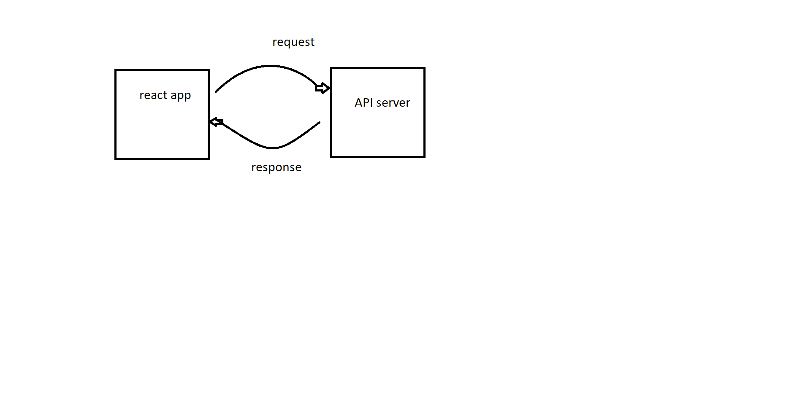

# City Explorer

**Author**: Omar Ali
**Version :** 1.0.0

## Overview

the app is used to display a specific location and its latitude and longitud

## Getting Started
you only need to write a city that you want it 

## Architecture
this app has been created using React.js

## Credit and Collaborations

## Time Estimates

**Name of feature :** 

**Estimate of time needed to complete :** 3 hours

**Start time :** 7:30pm

**Finish time :** 5:30Am

**Actual time needed to complete :** 5 hours